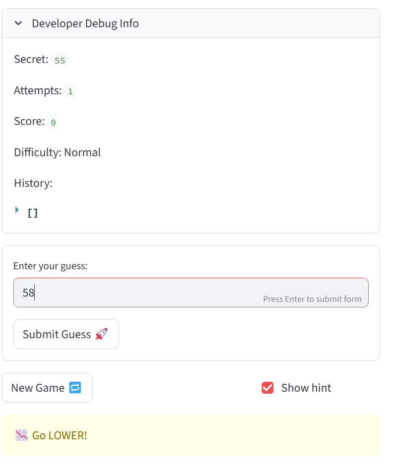
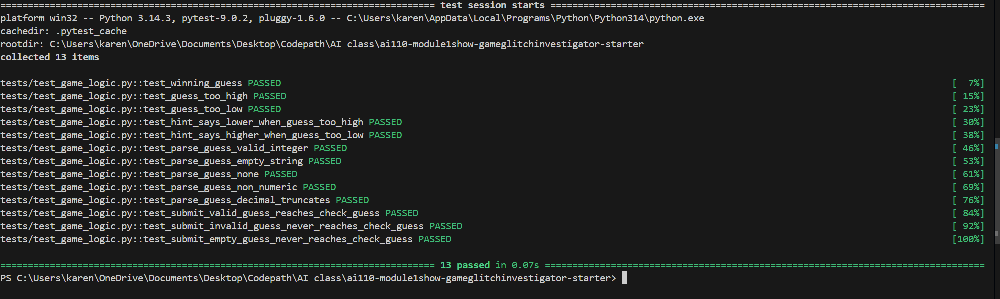

# 🎮 Game Glitch Investigator: The Impossible Guesser

## 🚨 The Situation

You asked an AI to build a simple "Number Guessing Game" using Streamlit.
It wrote the code, ran away, and now the game is unplayable. 

- You can't win.
- The hints lie to you.
- The secret number seems to have commitment issues.

## 🛠️ Setup

1. Install dependencies: `pip install -r requirements.txt`
2. Run the broken app: `python -m streamlit run app.py`

## 🕵️‍♂️ Your Mission

1. **Play the game.** Open the "Developer Debug Info" tab in the app to see the secret number. Try to win.
2. **Find the State Bug.** Why does the secret number change every time you click "Submit"? Ask ChatGPT: *"How do I keep a variable from resetting in Streamlit when I click a button?"*
3. **Fix the Logic.** The hints ("Higher/Lower") are wrong. Fix them.
4. **Refactor & Test.** - Move the logic into `logic_utils.py`.
   - Run `pytest` in your terminal.
   - Keep fixing until all tests pass!

## 📝 Document Your Experience

- This game is a guessing game. It simply asks the user to guess  a number between 1 and 100. It tells the person if they are close or not and if they need to go higher or lower. It also gives 8 tries, after which it tells the answer.
-  I found a lot of bugs including:
1. The input box tells me to press enter to apply, but it doesn't work
  2. The hint only says go lower, when it is supposed to be going higher
  3. It shows me the answer when I still have one attempt left
  4. New game resets the attemps part of the code, but it does not do anything esle to make me be able to play again;  i.e the history is still filled up.
  5. Easy - Hard range is weird. Needs to be corrected
  6. Even when the difficulty level changed, the instruction did not change. .
- However, I fixed only the first 2 bugs I mentioned above.

## 📸 Demo

- 
- The results of the pytest I had to run

## 🚀 Stretch Features

- [ ] [If you choose to complete Challenge 4, insert a screenshot of your Enhanced Game UI here]
